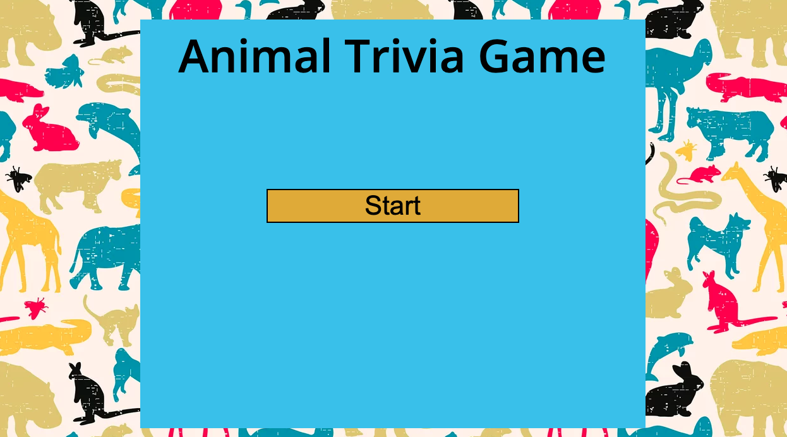

# [Animal Trivia Game](https://steffisbootcampdrive.github.io/TriviaGame/index.html)
### by Stephanie Wellington

## Overview
I built this with my 4 year old son in mind. He loves animals. To win this game you must answer each question correctly in the given amount of time. 
There is 30 seconds to answer the question and then a fun gif of the correct animal after you answer. Play again and again until you win every time!

## Technologies
* Javascript
* CSS
* Google Fonts
* HTML5

## The working Animal Trivia Game
* click on the image to go to the game
